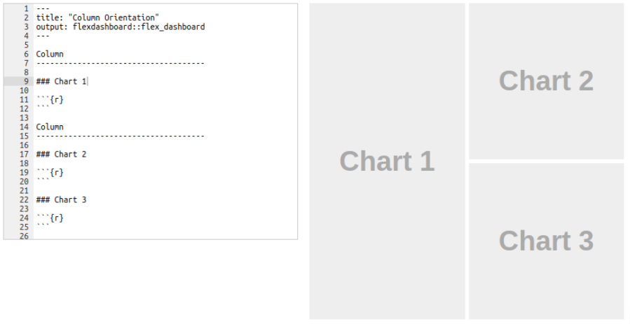
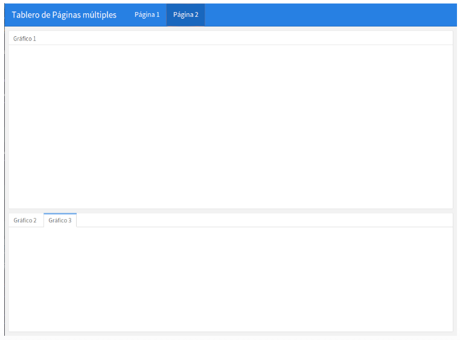
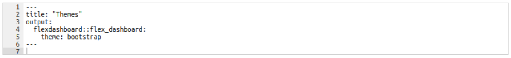
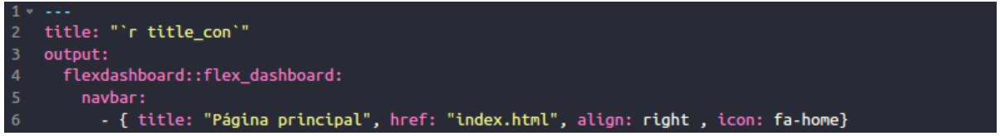
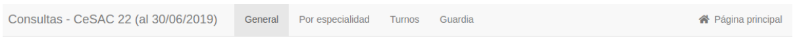
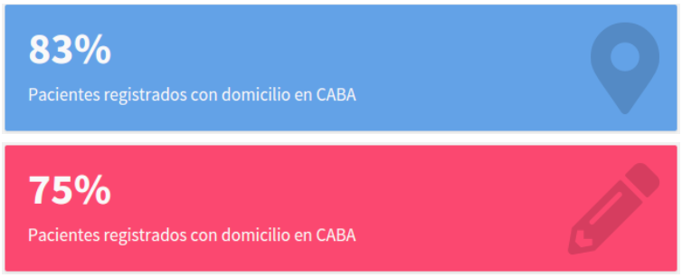
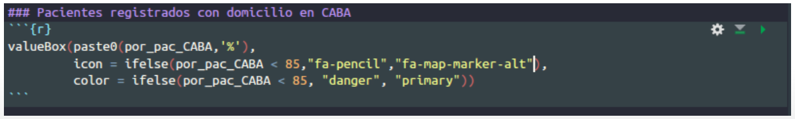
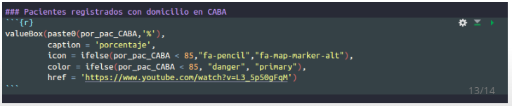

  
```{r setup, include=FALSE}
knitr::opts_chunk$set(echo = FALSE,warning = FALSE,message=FALSE)
library(tidyverse)
library(flexdashboard)
```

```{r carga datos}
pacientes_muestra <- read.csv('../datasets/pacientes_muestra.csv')
efectores <- read.csv('../datasets/efectores.csv')
consultas_muestra <- read.csv('../datasets/consultas_muestra.csv')
```

```{r, ejemplo Value Box}
pacientes_origen <- pacientes_muestra %>% 
  filter(!is.na(departamento)) %>% 
  mutate(origen = if_else(str_detect(departamento,'comuna'),'CABA','Otro')) %>% 
  group_by(origen) %>% 
  summarise(n=n()) %>% 
  mutate(per = n / sum(n))
por_pac_CABA <- round(pacientes_origen$per[pacientes_origen$origen=='CABA'],2)
```

## Objetivos del taller
- <del>Conocer el flujo de archivos en la generación de un documento a partir de *R Markdown*.</del>
- <span style="color:black">Generar un tablero: *flexdashboard*</span>
- Conocer diversas herramientas de visualización y presentación de datos:
- Valores puntuales: *ValueBox*
- Mapas: *leaflet*
- Gráficos dinámicos: *highcharter*
- Tablas dinámicas: *htmlwidgets*
  
## Objetivos de la clase 
- ¿Qué es un tablero?
- Conocer la biblioteca *flexdashboard*
- Generar un tablero preliminar.

## ¿Qué es un tablero?
Los tableros son herramientas visuales con énfasis en la información gráfica. Esto es así porque la representación gráfica, manejada adecuadamente, puede comunicar de manera más eficiente y enriquecedora que el texto. Los tableros muestran información necesaria para alcanzar objetivos específicos, por lo que el tipo de información puede ser muy variada.  

En general, un **tablero**:  
- **Cabe en una pantalla**. El objetivo es tener la información más importante a disposición rápidamente y sin esfuerzo.  
- **Tiene un diseño claro**, conciso e intuitivo.  
- **Es personalizado**. La información que presenta tiene que estar pensada específicamente para una persona, grupo o función. De lo contrario no cumple su propósito. 

## ¿Qué es *flexdashboard*?
Es una biblioteca de R que:  

- Mediante R Markdown permite publicar un grupo de visualizaciones relacionadas (aka, tablero).  

- Soporta una amplia variedad de componentes incluyendo *htmlwidgets*, gráficos, tablas, *value boxes* y texto.  

- Genera de manera fácil y flexible diversos diseños de tipo fila-columna. Los componentes son reescalados para ocupar todo el navegador y se adaptan a dispositivos móviles.

## Diseño
El tablero se puede dividir en filas y columnas (*orientación*) que pueden ocupar toda la pantalla o se puede habilitar el desplazamiento (scroll).  
Por defecto, al menos 3 guiones `---` definen columnas con los gráficos apilados en cada una de ellas:
<center>
```{r, out.width = "600px"}

```
</center>

## Diseño: filas/columnas 
Entre llaves, para cada una de las filas/columnas podemos determinar ciertas propiedades.  

-<span style="color:red">{</span> data-width=400<span style="color:red">}</span> : Ancho de la columna (en px)  

-<span style="color:red">{</span> data-height=650<span style="color:red">}</span>: Alto de la fila (en px)   

-<span style="color:red">{</span> .tabset<span style="color:red">}</span>: Pestañas en la fila/columna  

-<span style="color:red">{</span> .no-padding<span style="color:red">}</span> o <span style="color:red">{</span> data-padding=10<span style="color:red">}</span> : Elimina o determina el número de píxeles alrededor de cada gráfico (por defecto se agregan 8 px). 

## Diseño: Páginas
Para incluir páginas en la barra de navegación se agrega un nuevo nivel usando al menos 3 signos igual consecutivos `===`

<center>
```{r, out.width = "500px"}

```
</center>

## Diseño: Páginas
Para cada una de las páginas podemos determinar ciertas propiedades. 

-<span style="color:red">{</span>data-orientation=rows<span style="color:red">}</span>: para definir la orientación de los objetos.  

-<span style="color:red">{</span>.hidden<span style="color:red">}</span>: para ocultar una página de la barra de navegación.  

-<span style="color:red">{</span>data-navmenu="Menu A"<span style="color:red">}</span>: para anidar páginas a ciertos menús.

-<span style="color:red">{</span>data-icon="fa-list"<span style="color:red">}</span>: para incluir un ícono en la página

## Diseño: Temas
Para modificar la apariencia general del tablero hay disponibles temas base.
El default corresponde al tema *cosmo*. Si el tablero está incluido en otro contenido, el tema *bootstrap* es una buena elección ya que no usa colores estridentes.  

Para especificar un tema alternativo se utiliza el encabezado yaml.

<center>
```{r, out.width = "800px"}

```
</center>

## Diseño: Barra de navegación
Se pueden personalizar links en la barra de navegación.
Los items de navegación tienen que incluir al menos un título o un ícono y el URL correspondiente. La alineación es opcional, por defecto es a la derecha.

<center>
```{r, out.width = "800px"}

```
 
El código genera un link a la página principal del sitio web.

```{r, out.width = "800px"}

```
</center>

## Value Box
Para informar valores puntuales *flexdashboard* incluye la función **valueBox** que genera un output como el siguiente:

<center>
```{r, out.width = "500px"}

# knitr::include_graphics("~/desarrollo_profesional/tableros/clase_2/valueBox2.png")
```
</center>
El código que lo genera puede incluir condicionales para determinar el formato.

<center>
```{r, out.width = "800px"}

```
</center>

## Value Box
La funcion posee los siguientes argumentos:  
<font size="5">
- **valor**. Necesario, puede ser numérico o texto corto.    
- **subtítulo**. No es necesario, por defecto toma el título del objeto (*###*).  
- **ícono**. Por defecto está vacío. Se pueden usar de 3 fuentes *Font Awesome* (fa-X), *Ionicons* (ion-X) y *Bootstrap Glyphicons* (glyphicon-X).  
- **color**. Por defecto es celeste (*primary*). Los colores se pueden personalizar (“#ffffff”, “rgb(100,100,100)”, etc.), pero trae 5 definidos por nombre: *primary* celeste, *info* lila,  *success* verde, *warning* naranja y *danger* rosa furioso.  
- **href**. Para incluir un link a URL o un ancla ('#details') de otra página del tablero.
</font>
<center>
```{r, out.width = "800px"}

```
</center>

## Bibliografía y recursos
- Few, S. (2006). Information dashboard design: the effective visual communication of data.
- [R Markdown: The Definitive Guide. Yihui Xie, J. J. Allaire, Garrett Grolemund (2019-06-03)](https://bookdown.org/yihui/rmarkdown/)
- [flexdashboard: Easy interactive dashboards for R](https://rmarkdown.rstudio.com/flexdashboard)